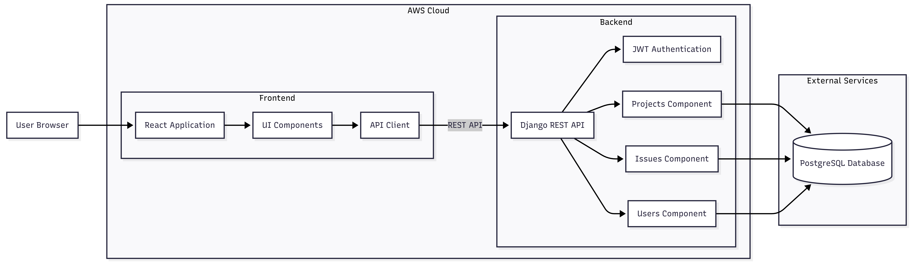

# ABCDH Project Intelligence Platform

Una plataforma de gestión de proyectos y seguimiento de tareas diseñada para ayudar a los equipos a planificar, organizar y monitorear su trabajo de manera eficiente.

La aplicación permite crear y administrar proyectos, tareas e incidencias, asignarlas a miembros del equipo y dar seguimiento a su progreso a lo largo del flujo de trabajo. Su objetivo es centralizar la gestión del trabajo en un solo lugar, facilitando la colaboración, la visibilidad del progreso y la organización de las actividades del equipo.

---

## Tech Stack

Esta aplicación está construida con el siguiente stack tecnológico:

* **Frontend:** React
* **Backend:** Django
* **Base de datos:** PostgreSQL

---

## Arquitectura

La aplicación sigue una arquitectura cliente-servidor:

* **React** se encarga de la interfaz de usuario y la experiencia en el navegador.
* **Django** provee la API y la lógica de negocio del backend.
* **PostgreSQL** almacena y gestiona los datos de la aplicación.

```
React (Frontend)
       │
       ▼
Django API (Backend)
       │
       ▼
PostgreSQL (Database)
```

---

## Stack Detallado

| Capa     | Tecnología | Descripción                                                 |
| -------- | ---------- | ----------------------------------------------------------- |
| Frontend | React      | Framework para construir interfaces de usuario interactivas |
| Backend  | Django     | Framework web en Python para APIs y lógica del servidor     |
| Database | PostgreSQL | Sistema de base de datos relacional robusto                 |

---

## Diagrama de Componentes



---